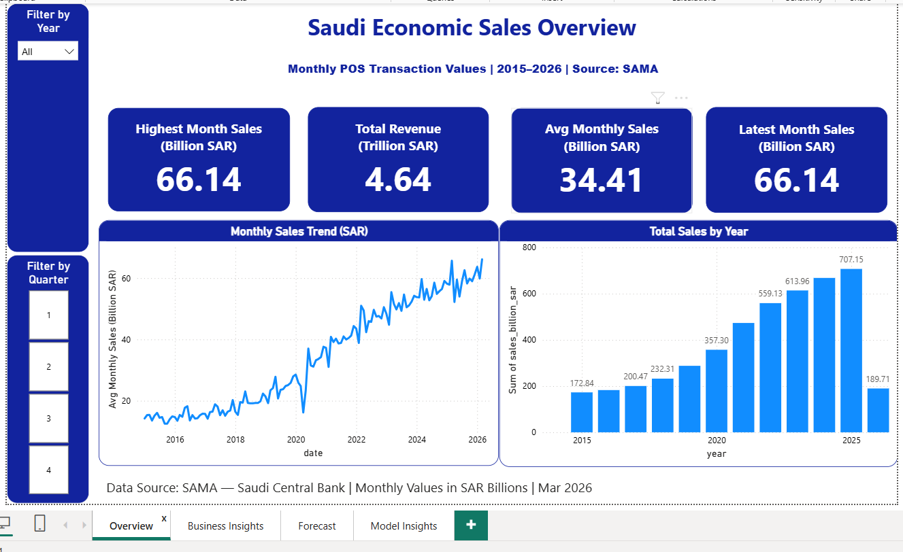
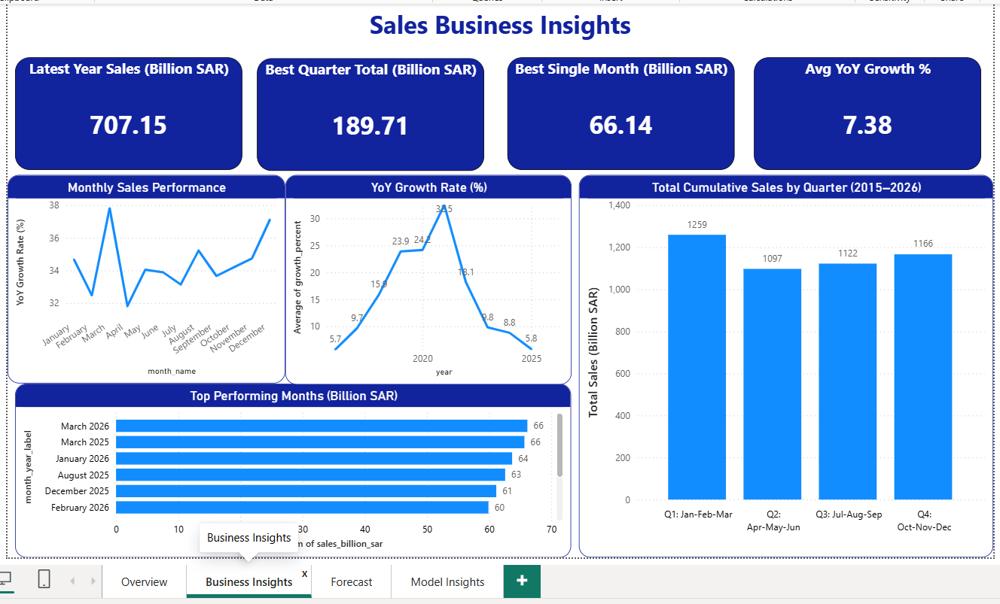
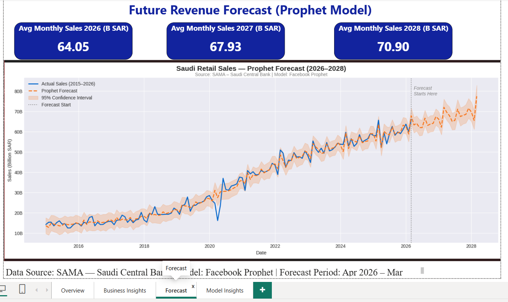
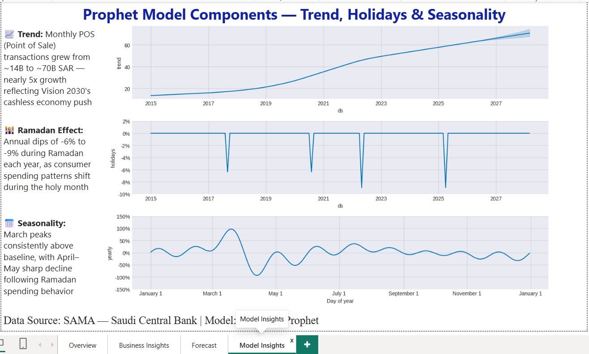

# 🇸🇦 SAMA Saudi Central Bank — POS Transaction Forecasting Dashboard


## 📌 Project Overview

This project analyzes **11 years of Saudi Central Bank (SAMA) Point of Sale (POS) 
transaction data** (January 2015 – March 2026) and builds a **24-month Prophet 
machine learning forecast** (April 2026 – March 2028).

The final deliverable is a **4-page interactive Power BI dashboard** combining 
historical analysis, business insights, ML forecasting, and model component analysis.

> 💡 **What is POS data?** Every time a Saudi resident pays by card at a shop, 
> restaurant, or online — that transaction is recorded. SAMA publishes monthly totals 
> for the entire country. This dataset reflects the growth of Saudi Arabia's 
> cashless economy under Vision 2030.

---

## 🎯 Key Findings

| Finding | Detail |
|---|---|
| 📈 **5x Growth** | Monthly POS sales grew from ~14B SAR (2015) to ~66B SAR (2026) |
| 💰 **Total Revenue** | 4.64 Trillion SAR in card transactions over 11 years |
| 🏆 **All-Time High** | March 2026 = 66.14B SAR — highest single month ever recorded |
| 🕌 **Ramadan Effect** | Annual dips of -6% to -9% detected automatically by Prophet |
| 📅 **Peak Month** | March is consistently the highest spending month every year |
| 🔮 **Forecast** | Monthly sales projected: 64B (2026) → 68B (2027) → 71B (2028) |
| 🇸🇦 **Vision 2030** | Growth directly reflects Saudi Arabia's cashless economy push |

---

## 📊 Model Accuracy

The Prophet model was validated using **cross validation across 13 historical 
time windows** (2019–2025):

| Metric | Value | Meaning |
|---|---|---|
| **MAE** | 3.53 Billion SAR | Average monthly prediction error |
| **RMSE** | 4.54 Billion SAR | Weighted prediction error |
| **MAPE** | **8.85%** | Model predicts within 8.85% of actual values |

> ✅ Under 10% MAPE is considered strong accuracy for macro-level economic 
> forecasting — especially given COVID-19 disruption in 2020 and annual 
> Ramadan calendar shifts.

---

## 🖥️ Dashboard Pages

### Page 1 — Saudi Economic Sales Overview


### Page 2 — Sales Business Insights


### Page 3 — Future Revenue Forecast (Prophet Model)


### Page 4 — Prophet Model Components


---

## 🛠️ Tools & Technologies

| Tool | Purpose |
|---|---|
| **Python** | Data cleaning, EDA, Prophet forecasting |
| **Facebook Prophet** | Time series ML forecasting model |
| **SQLite / SQL** | Data aggregation and business queries |
| **Power BI** | 4-page interactive dashboard |
| **Pandas** | Data manipulation and analysis |
| **Matplotlib** | Data visualization and chart creation |
| **Google Colab** | Cloud-based notebook environment |

---

## 📁 Project Structure
sama-forecasting-dashboard/

│

├── 📂 data/

│   ├── saudi_sales_clean.csv          # Cleaned dataset (135 rows, 2015-2026)

│   ├── forecast_future_only.csv       # 24-month future predictions

│   └── forecast_results.csv           # Full historical + forecast results

│

├── 📂 notebooks/

│   ├── 01_data_cleaning.ipynb         # Data cleaning and preparation

│   ├── 02_sql_analysis.ipynb          # SQL business queries

│   ├── 03_visualization.ipynb         # Exploratory data analysis charts

│   └── 04_forecasting.ipynb           # Prophet model + accuracy validation

│

├── 📂 sql_results/

│   ├── monthly_sales.csv              # Avg/Max/Min by month

│   ├── quarterly_sales.csv            # Quarterly aggregations

│   ├── top10_months.csv               # Top 10 best performing months

│   ├── yearly_sales.csv               # Annual totals

│   └── yoy_growth.csv                 # Year-over-year growth rates

│

├── 📂 screenshots/

│   ├── page1_overview.png             # Dashboard Page 1

│   ├── page2_insights.png             # Dashboard Page 2

│   ├── page3_forecast.png             # Dashboard Page 3

│   └── page4_model.png                # Dashboard Page 4

│

├── 📂 dashboard/

│   └── Forecating.pbix                # Power BI dashboard file

│

└── README.md

---

## 🔍 Prophet Model Configuration

```python
model = Prophet(
    yearly_seasonality=True,           # Capture yearly patterns
    weekly_seasonality=False,          # Monthly data — no weekly patterns
    daily_seasonality=False,           # Monthly data — no daily patterns
    seasonality_mode='multiplicative', # Seasonal effect grows with trend
    changepoint_prior_scale=0.1,       # Moderate trend flexibility
    seasonality_prior_scale=10,        # Strong seasonality detection
    interval_width=0.95                # 95% confidence interval
)
model.add_country_holidays(country_name='SA')  # Saudi holidays including Ramadan
```

---

## 📈 What the Model Detected Automatically

### 1. Long-Term Trend
Saudi POS transactions grew nearly **5x** from 14B to 70B+ SAR over 13 years,
reflecting Vision 2030's cashless economy initiative.

### 2. Ramadan Holiday Effect
Prophet automatically detected annual dips of **-6% to -9%** during Ramadan 
each year — without being explicitly told about Islamic holidays.

### 3. March Seasonality Peak
March is consistently the **highest spending month** (+100% above baseline),
followed by a sharp April–May decline reflecting post-Ramadan behavior.

---

## 🚀 How to Run

### Python Notebooks
```bash
pip install prophet pandas matplotlib scikit-learn
jupyter notebook notebooks/04_forecasting.ipynb
```

### Power BI Dashboard
1. Download `dashboard/Forecating.pbix`
2. Open in **Power BI Desktop** (free from Microsoft)
3. Update data source path to your local `data/` folder
4. Refresh data — all 4 pages will load automatically

---

## 📋 Data Source

- **Source:** Saudi Central Bank (SAMA) — official government statistics
- **Dataset:** Monthly POS Transaction Values (Thousands SAR)
- **Coverage:** January 2015 – March 2026 (135 months)
- **Access:** [SAMA Payment Statistics](https://www.sama.gov.sa)
- **License:** Public government data — free for educational use

---

## 👨‍💻 Author

**Hashim Khan**

- 🐙 GitHub: [Hashimkhan303](https://github.com/Hashimkhan303)
- 💼 LinkedIn: *([paste your LinkedIn URL here](https://www.linkedin.com/in/hashim-khan-96b5082b4/))
- 🎓 Google Data Analytics Certificate
- 🎓 Google Advanced Data Analytics Certificate

---

## 📄 License

This project uses publicly available data from the Saudi Central Bank (SAMA).
Built for educational and portfolio purposes only.

---

⭐ **If you found this project useful, please give it a star!**
